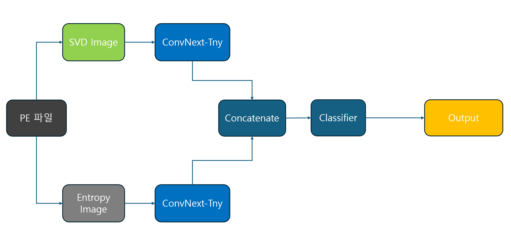
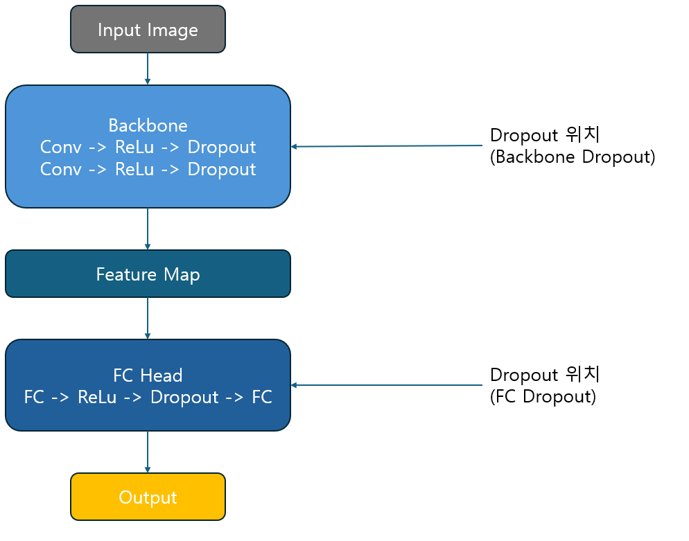

# 🛡️ AI 기반 악성코드 이진 분류 시스템: 프로젝트 기술 보고서 (README)

## 📚 목차 (Table of Contents)

- [Part 1. 머신러닝 기반 정적 분석](#part1-머신러닝-기반-정적-분석)
- [Part 2. 이미지 변환 방식 설계](#part-2-이미지-변환-방식-설계)
- [Part 3. CNN 단일 입력 실험 (SVD Only)](#part-3-cnn-단일-입력-실험-svd-only)
- [Part 4. Dual-Branch CNN 구조로의 확장](#part-4-dual-branch-cnn-구조로의-확장)
- [Part 5. Dual-Branch 모델 성능 개선을 위한 Ablation Study](#part-5-dual-branch-모델-성능-개선을-위한-ablation-study)
  - [5.1 Branch별 증강 전략 실험](#51-branch별-증강-전략-실험)
  - [5.2 일반 학습 Trick 실험](#52-일반-학습-trick-실험)
  - [5.3 Dropout & EMA 적용 실험](#53-dropout--ema-적용-실험)
  - [5.4 Adaptive Unfreeze + SWA 실험](#54-adaptive-unfreeze--swa-실험)
  - [5.5 Adaptive Rank 조정 및 Attention 실험](#55-adaptive-rank-조정-및-attention-실험)
  - [5.6 Scheduler 및 Optimizer 튜닝 실험](#56-scheduler-및-optimizer-튜닝-실험)
  - [5.7 Meta Feature + Stacking Ensemble 실험](#57-meta-feature--stacking-ensemble-실험)
- [Part 6. 최종 모델 선정 및 성능 요약](#part-6-최종-모델-선정-및-성능-요약)


## 📌 프로젝트 개요

본 프로젝트는 산학협력 과목의 일환으로 진행되었으며, 악성코드의 탐지 정확도와 일반화 성능을 극대화할 수 있는 **웹 기반 이진 분류 시스템**을 구축하는 것이 목표였습니다.

본 보고서는 그 중 핵심 기술 요소인 **AI 기반 탐지 엔진의 설계 및 구현 과정**을 상세히 기술한 문서입니다.


---

## 🧭 기술 전략 요약

초기에는 머신러닝 기반의 정적 분석 기법으로 시작하였으나, 여러 한계를 겪은 후 이미지 기반 CNN 분류 구조로 전환하였습니다.

전체 전략 전환의 흐름은 다음과 같습니다:

| 단계  | 접근 방식                           | 설명                                   |
| --- | ------------------------------- | ------------------------------------ |
| 1단계 | 정적 feature + ML (XGBoost 등)     | PE 기반 feature 추출, 빠른 학습, baseline 확보 |
| 2단계 | 이미지 기반 CNN (SVD 컬러변환)           | 변종 탐지 및 시각 패턴 학습 가능성 탐색              |
| 3단계 | Dual-Branch CNN (SVD + Entropy) | 다양한 시각 정보를 병렬 처리하여 시너지 확보            |
| 4단계 | Meta feature / 앙상블 실험       | LightGBM + CNN Stacking, Attention등 고도화 |
---

📌 초기 머신러닝 기반 실험에서는 기존 정적 feature 추출 데이터(static.csv 약 18,000개)와  
직접 수집한 PE 파일(13,000개)을 결합하여 총 31,000개의 학습 데이터를 활용하였습니다.

하지만 CNN 기반 구조로 전환하면서, 기존의 정적 feature 데이터는 이미지화가 불가능하여 제외되었고,  
이로 인해 사용 가능한 학습 데이터가 13,000개 수준으로 급감하는 문제가 발생했습니다.

이를 해결하기 위해, CNN 학습에 적합한 **PE/바이너리 원본 파일을 추가로 수집**하였으며,  
최종적으로 **38,224개 규모의 이미지 전용 학습 데이터셋(SVD + Entropy)**을 구성하게 되었습니다.

이 데이터셋은 이후 실험에 사용된 모든 CNN 모델(Dual Branch, Attention 주입 등)의 기반이 되었습니다.


# Part1: 🧠 머신러닝 기반 정적 분석

### 🔬 사용된 feature 추출 도구

| 도구       | 용도                                                         |
| -------- | ---------------------------------------------------------- |
| `pefile` | Section 수, Import된 DLL, entry point 등 PE 구조 파싱             |
| `lief`   | Low-level PE 메타데이터, symbol table, relocation table 등 정밀 추출 |
| [`yara`](../yara_rules/yara_rules.md)   | 악성 패턴 rule 기반 탐지 feature 생성 (`.yar` signature rule 적용)     |

이러한 도구들을 통해 약 **18,000개**의 기존 `static.csv` 데이터 외에도, **[KT Aivle](https://bdp.kt.co.kr/invoke/SOKBP2603/?goodsCode=KIS00000000000000013)에서 수집한 최신 benign/malware 13,000개** 데이터를 추가하여 총 **31,000개 규모**의 정적 데이터셋을 구축하였습니다.

📌 **주의**: 추가 수집된 benign\:malware 비율은 약 3:10으로 **불균형이 심화됨**

---

## 🌲 트리 기반 ML 모델 성능 비교

| Model      | F1 (Benign) | F1 (Malware) | Accuracy |
| ---------- | ----------- | ------------ | -------- |
| XGBoost    | 0.9555      | 0.9695       | 0.9638   |
| CatBoost   | 0.9528      | 0.9679       | 0.9618   |
| LightGBM ✅ | 0.9650      | 0.9759       | 0.9714   |

📌 **F1-Score는 클래스 불균형 환경에서 유용하며, Accuracy는 전체 분류 정확도 확인에 사용됩니다.**

---

## ⚙️ Optuna 기반 하이퍼파라미터 튜닝

성능이 가장 우수한 LightGBM 모델을 대상으로, 자동화된 하이퍼파라미터 최적화 도구 **Optuna**를 사용하여 탐색을 수행하였습니다.

* 탐색 대상 파라미터: `num_leaves`, `max_depth`, `learning_rate`, `lambda_l1`, `lambda_l2`, `bagging_fraction`, `feature_fraction` 등
* 탐색 전략: Tree-structured Parzen Estimator (TPE)
* 조기 종료: Early pruning 기능 적용

튜닝 결과, baseline 대비 Accuracy 및 F1-score가 소폭 개선되었으며, 해당 값은 이후 CNN 비교 실험에서도 기준 지표로 활용되었습니다.

---

## ❗ 머신러닝 접근의 한계 인식

하지만 ML 기반 접근은 다음과 같은 한계를 드러냈습니다:

* 사람이 설계한 feature에 지나치게 의존 → **표현력 제한**
* `obfuscation`, `packing`, 난독화된 악성코드에 대해 feature가 손실되거나 왜곡
* `.bytes` 형식의 악성코드에선 feature 자체가 추출되지 않아 **데이터셋 활용 제한**

📌 따라서 모델이 **원시 데이터를 직접 학습할 수 있는 구조로의 전환**이 필요했고, 그 대안으로 **CNN 기반 이미지 분류 방식**을 도입하였습니다.

# 🖼️ Part 2: 이미지 변환 방식 설계

## 1. Grayscale 방식 (Baseline)

가장 단순한 이미지화 방식은 바이너리를 `uint8` 배열로 변환한 후, 일정한 width로 reshape하여 **Grayscale 이미지**를 만드는 방식입니다.

✅ **장점**: 정보 손실 없음, 구현이 간단함
⚠️ **단점**: 채널 정보가 없기 때문에 CNN이 구분 가능한 시각적 패턴이 매우 제한됨

> 실제 실험에서도 CNN은 Grayscale 입력에 대해 일정 수준의 성능은 보였지만,
> **정상/악성 간 경계가 흐릿하게 표현되는 문제**가 존재하였습니다.

---

## 2. SVD 기반 컬러 이미지 (도입)

이를 개선하기 위해, **SVD (Singular Value Decomposition)** 기반 방식으로 변환 방식을 업그레이드하였습니다.

### ⚙️ 구현 절차

1. PE/바이너리 파일을 `uint8` 배열로 변환
2. 2D 매트릭스로 reshape
3. **SVD 적용 → 주요 성분 추출**
4. R/G/B 채널에 각각 주요 성분 할당
5. `Jet` 컬러맵을 적용해 시각적 분포를 극대화한 컬러 이미지 생성

📄 [논문 기반 성능 차이](/figure/peerj-cs-2727.pdf)

* Grayscale 대비 **F1-score 기준 약 3\~5% 성능 향상**
* SVD 기반 컬러 이미지에서는 CNN이 각 채널을 통해 구조 밀도, 경계, 텍스처를 분리 학습 가능

---

## 3. `auto_width` 기반 동적 이미지 크기 설계

CNN 모델들은 `224x224` 입력을 기본으로 요구하지만,
일본 PE 파일의 크기는 수십 KB부터 수 MB까지 다양하여 단순 고정 width는 구조 왜곡을 유발합니다.

이를 해결하기 위해, 아래의 \*\*정사각형 보존 중심의 자동 해상도 설계 함수 `auto_width()`\*\*를 적용했습니다.

✅ `auto_width` 알고리즘 핵심 원리

* 구조 보존을 위해 **정사각형에 가까운 width**를 자동 선택
* `aspect ratio ≤ 2.0 && height ≤ 2048` 조건을 만족하는 경우에만 선택
* 최종적으로는 resize(224, 224) 처리

```python
def auto_width(length):
    candidate_widths = [
        4096, 3584, 3072, 2560, 2048, 1792, 1536, 1280,
        1024, 896, 768, 640, 512, 448, 384, 320,
        256, 224, 192, 160, 128, 96, 64, 48, 32
    ]

    best_width = None
    min_diff = float('inf')

    for width in candidate_widths:
        height = int(np.ceil(length / width))
        aspect_ratio = height / width
        if aspect_ratio <= 2.0 and height <= 2048:
            diff = abs(height - width)
            if diff < min_diff:
                min_diff = diff
                best_width = width

    return best_width if best_width else 4096
```

---

## 📌 효과 요약

✅ 각 파일 구조에 맞는 최적 width 선택 → **형태 보존률을 높이면서 padding 감소 + 시각적 잡음 최소화**
✅ CNN 입력 시 `resize(224, 224)` 처리를 통해 통일성 확보
✅ 실험 결과: `auto_width` 적용 모델이 고정형보다 **F1-score 및 Accuracy 기준으로 최대 2\~3% 향상**

---

## ✅ 최종 요약

| 비교 항목   | Grayscale   | SVD 기반            |
| ------- | ----------- | ----------------- |
| 채널 수    | 1 (Gray)    | 3 (RGB)           |
| 정보 표현   | 단조로운 밝기 분포  | 구조 압축 + 시각적 밀도 강조 |
| 성능      | baseline 수준 | F1 +3\~5% 향상      |
| 시각적 분석력 | 약함          | 뚜렷함               |

> 본 이미지 전처리 설계는 논문 기반 분석, 구조적 실험, 성능 향상 검증 결과를 통해 완성되었으며,
> 이후 CNN 구조 설계로 연결됩니다.

# 🔬 Part 3: CNN 단일 입력 실험 (SVD Only)

## 📖 실험 배경

초기 이미지 기반 접근은 **SVD 이미지 단일 입력만을 사용하는 구조**로 시작되었습니다.
참고한 논문 \[PeerJ CS, 2023]에서는 SVD 기반 CNN 모델이 기존 grayscale 기반 접근보다 우수한 성능을 보였기 때문에, 유사하게 **VGG16 Pretrained Backbone**을 사용한 구조로 baseline을 구축하였습니다.

---

## ⚙️ 실험 설정

* **Backbone**: `torchvision.models.vgg16_bn(pretrained=True)`
* **입력 이미지**: Adaptive Width 기반 SVD 이미지 (크기 조정 후 224x224)

### Classifier 구조:

```python
model.classifier = nn.Sequential(
    nn.Linear(25088, 500),
    nn.ReLU(),
    nn.Dropout(0.4),
    nn.Linear(500, num_classes)
)
```

* **Optimizer**: Adam (`lr=1e-4`)
* **Loss**: CrossEntropyLoss (class weight 적용)
* **Transform**: Albumentations 기반 기본 Normalization
```python
# 전이학습 모델을 사용할 때 꼭 적용해야 함
A.Normalize(mean=(0.485, 0.456, 0.406), 
            std=(0.229, 0.224, 0.225))
```
---

## 🖼️ SVD 이미지 처리 전략

SVD는 각 PE 파일의 구조적 밀도 정보를 압축하여 시각화한 방식이며,
`auto_width` 알고리즘을 사용해 각 파일에 맞는 적절한 width를 자동 계산합니다.

### 📌 `auto_width` 전략 요약:

* 고정된 이미지 크기 대신, 파일 길이에 따라 적절한 width를 선택
* 정사각형에 가깝고 height가 2048 이하인 조합 중 최적값을 선택
* 패딩 최소화 및 구조 보존성 향상

```python
# 예시: 135,000 bytes → 384x352 형태로 reshape
```

---

## 📊 성능 결과

| 조건                  | Accuracy | F1 (Benign) | F1 (Malware) |
| ------------------- | -------- | ----------- | ------------ |
| VGG16 + SVD (단일 입력) | 0.9431   | 0.8711      | 0.9635       |

* ✅ 악성코드 클래스(Malware)는 비교적 정확히 분류했으나, 정상(Benign) 클래스에서 F1-score가 낮게 측정됨
* 이는 오탐(False Positive)이 빈번하게 발생했음을 의미
* 특히 정상 파일 중에서도 구조적으로 난해하거나 noise가 많은 경우 오분류가 자주 발생

---

## ⚠️ 분석 및 한계점

* SVD 이미지는 파일 구조의 밀도 분포를 시각화하지만,

  * 해당 구조가 “왜” 악성인지에 대한 세부적 법렬 정보 부족
* 결과적으로 benign vs malware의 분포가 유사할 경우, VGG16이 이를 충분히 구분하지 못함
* 이는 **SVD 기반 단일 입력의 한계**를 시사함

---

## 🔄 다음 확장 방향

이러한 실험 결과를 통해 다음과 같은 개선 필요성이 도출되었습니다:

1. ✅ **다른 시각 정보 보조 채널 필요**

   * 구조 외에 entropy 기반의 비정형 패턴 보완

2. ✅ **보다 강력한 표현력을 가진 CNN 백본 필요**

   * VGG16은 단순하고 안정적이나, 깊이에 비해 성능 한계 존재

3. ✅ **다중 입력 브랜치 구조를 통한 시너지 효과 탐색**

   * 서로 다른 시각 정보를 분리된 경로로 처리 → 통합 학습 가능

---

### ✅ 결론:

VGG16 + SVD 단일 입력 실험은 구조 기반 시각 정보만으로는 정상/악성 코드 간 정확한 분리에 어려움이 있으며,
이에 따라 이후 실험에서는 **Entropy 이미지 도입 + Dual-Branch 구조 확장**을 주요 전략으로 설정하였습니다.

# 🌐 Part 4: Dual-Branch CNN 구조로의 확장

## 🚀 배경 및 필요성

앞선 VGG16 기반 SVD 단일 입력 CNN 실험에서는 구조적인 패턴을 어느 정도 포착하였지만,
정상/악성 간 경계를 명확히 나누기에는 **정보 표현의 다양성과 정밀도가 부족**한 결과를 보였습니다.

* SVD 이미지는 파일 내 구조적 패턴(섹션 배치, 길이 등)에 강점을 가지지만
* 정상 코드 내부의 복잡도/난독화 여부 등은 표현하기 어렵다는 한계 존재

이를 보완하기 위해, **정적 구조 정보를 표현하는 SVD와**
정보 난이도 및 복잡도를 시각화한 **Entropy 이미지**를 함께 사용하여
2개의 독립 브랜치에서 특징을 추출하고, 이를 결합하는 **Dual-Branch CNN 구조**로 확장하였습니다.

---

## 🌈 입력 구성

### 🔹 Branch 1: SVD 이미지

* **특징**: PE 파일 내 구조 정보 (Header, section 배치, 영역 비율 등)를 반영
* **전처리**: Auto-width로 reshape 후, 224x224 resize
* **활용 의의**: PE 구조를 기반으로 한 정형 정보 탐지에 강점

### 🔸 Branch 2: Entropy 이미지

* **특징**: 각 영역의 정보 밀도 및 무작위성 (shellcode, 난독화 등)을 local entropy로 표현
* **생성 방식**: `skimage.filters.rank.entropy` + `disk(5)` 커널
* **활용 의의**: 구조적으로는 정상처럼 보이지만 정보적으로 이상한 악성 샘플 탐지 가능

📌 이 두 이미지는 서로 다른 관점의 시각 정보를 담고 있으므로,
병렬적인 CNN branch로 처리하고, 후단에서 feature를 결합하는 방식이 적합함.

또한 아래와 같은 이유로 VGG16 모델에서 ConvNext-Tiny 모델로 교체함
| 항목               | ConvNeXt가 DualBranch에 유리한 이유 |
|--------------------|----------------------------------------|
| **표현력**         | ConvNeXt는 LayerNorm, GELU, Depthwise Conv 등을 활용하여 더 풍부하고 정교한 feature를 추출함 → 각 Branch가 전달하는 정보의 품질이 높아짐 |
| **구조적 유연성**  | Stage 단위 Unfreeze, Attention block 주입, SE/CBAM 연결 등에 유연하게 대응 가능 → Ablation에서 다양한 실험이 가능해짐 |
| **FLOPs 대비 성능 효율** | ConvNeXt-Tiny는 연산량은 낮으면서도 표현력은 매우 높음 → Dual 구조에 2배의 CNN이 필요해도 상대적으로 부담이 적음 |
| **정규화 안정성**   | ConvNeXt는 LayerNorm 기반 구조이기 때문에 두 branch 간 distribution 차이가 커도 안정적인 학습이 가능함 (VGG는 BatchNorm 기반이라 한계 있음) |
| **Residual 기반 설계** | Feature depth가 깊어져도 gradient vanishing 문제가 적고, 학습 안정성도 높음 → Dual 구조에서 중요한 점 |

---

## 🧠 모델 구조 (초기 DualBranchModel)

```
SVD Image     → ConvNeXt-Tiny ┐
                              ├─▶ [Concatenate] → Classifier → Output
Entropy Image → ConvNeXt-Tiny ┘
```


## ⚙️ 구성요소 요약

| 컴포넌트         | 설명                                           |
| ------------ | -------------------------------------------- |
| CNN Backbone | ConvNeXt-Tiny (pretrained on Facebook In22k) |
| Fusion       | 단순 Feature Concatenation                     |
| Classifier   | Linear → ReLu → Dropout → Linear → Output |
| Attention    | ❌ 없음 (Baseline에서는 Attention 미적용)             |

---

## 🧪 학습 환경 (Baseline 실험)

튜닝 없이, 모델 구조 자체의 가능성만 평가하기 위해 아래와 같은 구성으로 학습을 진행하였습니다:

| 항목            | 설정 값                        |
| ------------- | --------------------------- |
| Optimizer     | AdamW                       |
| Scheduler     | CosineAnnealingWarmRestarts |
| Learning Rate | 5e-5                        |
| Augmentation  | 없음                          |
| Batch Size    | 32                          |
| Epochs        | 30                          |

📌 데이터 전처리 외에는 CBAM, SEBlock, Mixup, CutMix 등 일체 미적용된 상태입니다.

---

## 📊 초기 Dual-Branch 결과 (No Tuning)

| 모델 구성                      | Accuracy | F1 (Benign) | F1 (Malware) |
| -------------------------- | -------- | ----------- | ------------ |
| VGG16 + SVD (단일 입력)        | 0.9433   | 0.8711      | 0.9635       |
| ConvNeXt-Tiny + DualBranch | 0.9704   | 0.9693      | 0.9713       |

* ✅ 단일 입력 모델 대비 모든 항목에서 성능이 상승
* 특히 benign class의 F1-score 향상이 뚜렷 → 오탐률 감소에 기여
* 추가적인 튜닝 없이도 Dual 구조의 장점이 수치적으로 입증됨
* ⚠️ 이때는 attention block 없이 단순 concatenation fusion 방식만 적용

---

## ✅ 정리

* **Dual-Branch 구조는 SVD와 Entropy의 시각적 특성을 병렬로 학습할 수 있어
  더 넓은 표현 공간을 확보하게 되었고,**
* 기본적인 실험만으로도 기존 CNN 단일 입력 구조를 능가하는 성능을 보였습니다.

# 🔬 Part 5: Dual-Branch 모델 성능 개선을 위한 Ablation Study

## 📌 개요

기존 단일 CNN 구조보다 성능이 우수했던 Dual-Branch 구조를 도입한 이후에도,
성능 향상의 여지는 여전히 존재했습니다. 본 파트에서는
\*\*기준 모델을 바탕으로 다양한 기법들을 순차적으로 실험(Ablation)\*\*하며,
각 기법의 **성능 기여도 및 한계**를 분석하였습니다.

---

## 🌿 구성

Part 5는 아래와 같은 실험 흐름을 따릅니다:

| 파트  | 제목                                  | 핵심 내용                                                   |
|-------|-------------------------------------|------------------------------------------------------------|
| 5.1   | Branch별 증강 전략 실험                    | SVD/Entropy 각 branch에 특화된 증강 기법을 분리 적용하여 성능 비교          |
| 5.2   | 일반 학습 Trick 실험                      | MixUp, Label Smoothing, Dropout 등의 일반적 학습 기법의 효과 분석           |
| 5.3   | Dropout & EMA 전략 실험               | Backbone과 Classifier의 Dropout, EMA 적용 여부에 따른 성능 비교          |
| 5.4   | Adaptive Unfreeze + SWA 실험         | 단계적 fine-tuning(Unfreeze)과 SWA를 결합한 미세조정 전략 실험           |
| 5.5   | Adaptive SVD 압축 Rank 조정 실험 및 Attention 주입 실험 | SVD Adaptive K-rank 전략과 SEBlock/CBAM attention, CrossAttentionFusion 모듈 적용 비교            |
| 5.6   | Scheduler 및 Optimizer 튜닝 실험         | 다양한 스케줄러(Cosine, ReduceLROnPlateau)와 Optimizer 조합 비교       |
| 5.7   | Meta Feature + Stacking Ensemble 실험   | 정적 feature 기반 LightGBM과 CNN 앙상블 구조 및 최적 조합 실험           |


---

## 🧪 5.1 Branch별 증강 전략 실험

## 🎯 실험 목적

SVD와 Entropy 이미지는 각기 다른 시각적 특성을 가지며,
동일한 증강을 일괄 적용하는 경우 정보 손실 혹은 불필요한 왜곡이 발생할 수 있음.
이에 따라 **각 Branch에 특화된 증강 기법**을 적용하여 성능 향상 가능성을 평가함.

Dual-Branch 구조는 입력 이미지로 **SVD와 Entropy** 두 가지를 사용합니다.
두 이미지가 지닌 특성이 다르기 때문에 동일한 증강을 일괄 적용하는 것은 **비효율적**이라고 판단하였습니다.

| Branch  | 증강 전략 설명                                   |
| ------- | ------------------------------------------ |
| SVD     | 구조 보존 중심의 증강 (Color Jitter, Center Crop 등) |
| Entropy | 텍스처 강화 중심 증강 (Noise, Blur, Sharpen 등)      |

### ✅ 적용 결과

* **Accuracy**: 0.9744
* **F1 (Benign)**: 0.9717
* **F1 (Malware)**: 0.9766

📌 해당 결과를 기준 **Dual-Branch 모델 성능의 baseline**으로 설정하고 이후 실험을 이어감

---

## 🧪 5.2 일반 학습 Trick 실험: MixUp, Label Smoothing, Dropout

## 🎯 실험 목적

기본적인 CNN 학습 과정에서 널리 사용되는 일반적인 Trick들의 성능 기여도를 개별적으로 확인하고,
Dual-Branch 구조에서도 유효한지 판단하기 위함.

### 🔧 기법 설명

* **MixUp**: 두 이미지를 선형 결합하여 입력으로 사용하고, 라벨도 비율에 맞춰 혼합
  → 결정 경계를 부드럽게 하여 일반화 성능 강화

* **Label Smoothing**: Hard한 0/1 라벨 대신, 정답 클래스에 0.9, 나머지에 0.1/(n-1) 할당
  → 모델이 과도하게 확신하지 않도록 유도

* **Dropout (FC Layer)**: FC Layer에서만 적용 (Backbone은 그대로)

### 📊 실험 조건 및 결과

| 실험코드 | MixUp | LS   | Dropout | Accuracy     |
| ---- | ----- | ---- | ------- | ------------ |
| D1   | 0.2   | 0.0  | 0.2     | 0.9723       |
| D2   | 0.2   | 0.02 | 0.5     | 0.9728       |
| D3   | 0.0   | 0.02 | 0.5     | **0.9744** ✅ |

✅ **D3 조합이 가장 우수하여 이후 실험의 기준 설정**

---

## 🧪 5.3 Backbone Dropout & EMA 적용 실험

## 🎯 실험 목적

기존 실험은 Fully Connected Layer에만 dropout을 적용했지만,
CNN의 과적합 억제를 위해 **Backbone 자체에도 dropout**을 도입하는 방식을 실험함.

또한, 학습 도중 모델 파라미터의 노이즈와 진동을 완화하기 위해
\*\*EMA (Exponential Moving Average)\*\*를 도입하여 일관된 파라미터 평균값으로 예측하도록 유도함.

---

## 🧩 개념 정리

### 📌 Backbone Dropout

* ConvNeXt 구조의 특정 block 뒤에 dropout 삽입
* Overfitting 방지를 위해 적용했으나, 정보 손실 우려도 있음



| 항목         | Backbone Dropout               | FC Dropout                     |
|--------------|--------------------------------|--------------------------------|
| **위치**     | Conv 블록 내부                 | FC (classifier) 내부           |
| **효과**     | 저수준 feature 다양성          | 고차 표현 regularization       |
| **일반 사용**| 잘 안 쓰는 경우도 있음 (overkill) | 널리 사용됨                    |
| **대표 모델**| 일부 ResNet 변형, Inception     | 대부분 classification head     |


### 📌 EMA (지수 이동 평균)

* 학습 중 각 step마다 현재 weight의 평균값을 유지
* 추론 시 EMA 파라미터로 예측하여 더 안정적인 성능 확보
* 일반적으로 validation loss가 불안정할 때 유용

---

## ⚙️ 실험 세팅

| 설정 | FC Dropout | Backbone Dropout | EMA 적용 | Accuracy |
| -- | ---------- | ---------------- | ------ | -------- |
| R1 | 0.5        | ❌                | ❌      | 0.9707   |
| R2 | 0.5        | ✅ 0.1            | ❌      | 0.9702   |
| R3 | 0.5        | ✅ 0.1            | ✅      | 0.9712   |

---

## 🔍 해석

* Backbone Dropout을 도입했을 때 **성능 하락** → 중요 Feature 손실 가능성
* EMA 도입 시 약간의 성능 회복 있었으나, 여전히 D3(0.9744)에는 미치지 못함

📌 **따라서 이후 실험은 Backbone Dropout 미적용 + FC Dropout 유지 + EMA 미적용 구성 유지**

---

## 🧪 5.4 Adaptive 2-Step Unfreeze & SWA 적용 실험

## 🎯 실험 목적

기존 pretrained 모델을 사용할 경우, 전체를 Freeze한 상태로 학습하면 feature 전이가 불충분하고,
반면 초기부터 전부 Unfreeze하면 과적합이나 gradient 불안정 문제가 발생할 수 있음.

따라서 이를 해결하기 위해, 학습 초반엔 feature extractor를 고정한 상태로 classifier만 학습한 뒤,
점진적으로 ConvNeXt의 하위 블록부터 점진적으로 해제(Unfreeze)하는 전략을 채택함.

또한 \*\*SWA (Stochastic Weight Averaging)\*\*를 도입해 모델 파라미터를 여러 checkpoint 평균으로 보간함으로써
전체 성능을 안정적으로 끌어올리고자 함.

---

## 🧱 ConvNeXt 구조와 Unfreeze 전략

ConvNeXt-Tiny는 다음과 같이 stage로 나뉨:

```
Stem → Stage1 (3 blocks) → Stage2 (3 blocks) → Stage3 (9 blocks) → Stage4 (3 blocks)
```

| `stage_level` | 학습 범위                         |
|---------------|----------------------------------|
| `0`           | FC만 학습, backbone은 전체 freeze |
| `1`           | FC + Stage4만 학습 가능           |
| `2`           | FC + Stage3 + Stage4 학습        |
| `3`           | 전체 학습 (Full Fine-tuning)     |

이 전 학습에서는 0:3을 옵션으로 줘서 전체를 학습하였음.

---

## 💡 SWA란?

* 학습 후반부 여러 checkpoint에서 저장된 파라미터를 단순 평균
* 일반적인 SGD보다 더 **일관된 성능**에 뛰어난 solution을 제공
* 특히 Validation Loss가 불안정하게 뛸 때, 효과적으로 수렴 가능

---

## ⚙️ 실험 세팅

| 설정 | Unfreeze 전략                     | Warmup Epoch | SWA 적용 Epoch | Accuracy |
| -- | ------------------------------- | ------------ | ------------ | -------- |
| U1 | 0:0 (Full Freeze) → 10:1 → 20:1 | 3            | ❌            | 0.9712   |
| U2 | 0:0 → 10:1 → 20:2               | 3            | ✅ 20         | 0.9728   |
| U3 | 0:0 → 15:1                      | 3            | ✅ 20         | 0.9714   |

📝 `0:x → 10:y` 의미: epoch 0에서는 `stage_level=x`, epoch 10에서는 `stage_level=y`로 설정하여 학습 가능한 ConvNeXt 블록을 점진적으로 확장함

📝 stage_level: 0=FC only, 1=+stage4, 2=+stage3, 3=all

📌 SWA는 20epoch부터 적용, 3epoch 간격으로 평균 시작

---

## 🔍 결과 분석

* **U1은 SWA 없이 단일 2단계 전이만 사용 → 성능 소폭 증가**
* **U2는 가장 세분화된 3단계 Unfreeze + SWA → 가장 높은 정확도 (0.9728)**
* **U3는 Unfreeze 타이밍이 늦어 학습 폭 줄어들며 성능 저하**

✅ **결론적으로, U2 전략이 가장 안정적인 성능 향상을 제공하였으며, 기준 D3 (0.9744)에는 미치지 못함**
→ 따라서 이후 실험에서는 여전히 D3 세팅을 Baseline으로 유지하기로 결정함.

---

## 🦪 5.5 Adaptive SVD 압축 Rank 조정 실험 및 Attention 주입 실험

## 🌟 배경 및 개선 필요성

최근 SVD 기반 시각화에서는 **full-rank SVD**를 사용하여 바이너리 파일을 2D 행렬로 변환한 뒤,  모든 특이값(singular values)을 포함한 상태에서 컬러맵(`Jet`)을 적용하여 이미지를 생성하였습니다.

그러나 **full-rank SVD 방식은 다음과 같은 단점**을 가지고 있었습니다:

| 문제점              | 설명                                                        |
| ---------------- | --------------------------------------------------------- |
| ❗ 불필요한 정보까지 포함   | 모든 특이값(singular values)을 사용하면서, 노이즈에 가까운 고차 성분까지 이미지에 반영됨 |
| ❗ 시각적 패턴의 명확성 저하 | 고주파 성분이 뒤섞이면서 CNN이 학습해야 할 중요한 구조적 특징이 흐려짐                 |
| ❗ 계산 낭비          | rank가 커질수록 SVD 계산량이 증가 → 학습 효율성 저하                        |

---

## 💡 개선 전략: Adaptive k-rank 기반 SVD 구성 및 Attention구조 실험

이러한 문제를 해결하기 위해, SVD의 rank를 **고정된 full-rank 대신, 각 이미지의 크기에 따라 적절히 조정**하는
**adaptive k-rank SVD 전략**을 도입했습니다.

### ✅ 해당 구현 코드

```python
def compute_adaptive_rank(height, width, alpha=0.1, k_min=20, k_max=100):
    base = int(min(height, width) * alpha)
    return max(k_min, min(k_max, base))
```

* `alpha`: 최소 축 기준 압축 비율 (10%)
* `k_min`, `k_max`: rank 하한/상한 제한
* `height`, `width`: auto-width 적용 후 이미지 크기 기준

📌 즉, **이미지가 클수록 더 많은 성분(rank)을 반영**하고,
작은 이미지에는 불필요한 고차 정보를 제거함으로써 **시각 정보의 품질과 계산 효율성의 균형을 맞춤**.

---

## ⚙️ 입력 구성 방식

기존처럼 full-rank SVD를 계산 하지 않고, **단일 채널 SVD 결과에 Jet 컬러맵을 적용해 RGB로 변환**하는 구조는 유지하지만,
내부적으로는 `adaptive rank` 기반으로 해당 핵심 성분만을 추출하여 이미지 품질을 제어합니다.

| 항목      | 기존 방식 (Full-Rank) | 개선 방식 (Adaptive Rank)     |
| ------- | ----------------- | ------------------------- |
| 사용 rank | 전체 성분 사용          | 입력 크기에 따라 20\~100 범위 내 조정 |
| 특징 표현력  | 고주파 혼입으로 경계 흐림    | 구조적 패턴 강조, 노이즈 억제         |
| 계산 효율   | 불필요한 연산 포함        | 이미지별 최적 rank로 효율 향상       |

---

## 📊 실험 결과 비교

| 실험 구성                     | Accuracy     | F1 (Benign) | F1 (Malware) |
| ------------------------- | ------------ | ----------- | ------------ |
| 기존 Full-Rank + Jet 컬러맵    | 0.9744       | 0.9717      | 0.9766       |
| ✅ Adaptive Rank + Jet 컬러맵 | **0.9749** ✅ | **0.9724**  | **0.9770**   |

* 단순 rank 조정만으로도 F1-score, Accuracy 모든 지표에서 미세하지만 **유의미한 성능 향상**

---

## ✅ 결론

Adaptive k-rank 기반의 SVD 구성은 다음과 같은 장점을 제공합니다:

1. **필요한 정보만을 유지하며 시각적 노이즈 최소화**
2. **모든 입력 이미지에 대해 일관된 구조 보존 + 정규화 효과**
3. **계산 효율성 향상 및 CNN 학습 안정성 증가**

이 실험을 통해, **단일 채널 SVD 구성에서도 rank 조정만으로 충분한 성능 확보가 가능**함을 입증했습니다. 또한,   
본 실험(5.5)부터는 Adaptive K-Rank 기반 이미지셋으로 전환하였으므로,
이후 실험의 baseline은 **해당 전처리 기반 모델 (Accuracy=0.9744)**로 재설정하였습니다.

---

## 📊 Attention 주입 실험

단일채널 Adaptive K-rank SVD 이미지 기반 Dual Branch 구조(SVD + Entropy)를 구성한 후,  
각 branch 내부에는 Attention 모듈을 주입하여 feature 표현력을 향상시키고자 하였고,  
또한 feature fusion 단계에서 단순 concat이 아닌 **Cross Attention 기반 결합**을 도입함.

### ✅ 실험 구성

| 설정                                | Cross Attention | Accuracy     |
| ----------------------------------- |----------------|--------------|
| ❌ SEBlock (w/o CrossAttention)     | ❌ 없음         | 0.9691       |
| ❌ CBAM (w/o CrossAttention)        | ❌ 없음         | 0.9718       |
| ✅ SEBlock (with CrossAttention)    | ✅ 적용         | **0.9754** ✅ |
| ✅ CBAM (with CrossAttention)       | ✅ 적용         | 0.9723       |

---

### 💡 Attention 모듈 분석

| 모듈    | 설명 |
|---------|------|
| **SEBlock** | 채널 간 중요도를 학습하여 동적으로 반영하는 lightweight 모듈. 계산량이 적고 성능 향상에 효과적 |
| **CBAM**    | Channel + Spatial attention을 함께 적용. 구조는 복잡하지만 본 실험에서는 상대적으로 성능 제한 |

---

### 🔀 Feature Fusion: Concat vs CrossAttention

기존에는 두 branch의 출력(feature vector)을 **단순 `concat` 후 linear projection**하는 방식이 일반적이나,  
본 실험에서는 다음의 **CrossAttentionFusion 모듈**을 사용해 정보 결합 방식을 개선함.

```python
class CrossAttentionFusion(nn.Module):
    def __init__(self, dim, heads=4, dropout=0.1):
        super().__init__()
        self.attn = nn.MultiheadAttention(embed_dim=dim, num_heads=heads, dropout=dropout, batch_first=True)
        self.norm = nn.LayerNorm(dim)
        self.mlp = nn.Sequential(
            nn.Linear(dim, dim * 2),
            nn.GELU(),
            nn.Linear(dim * 2, dim)
        )

    def forward(self, svd_feat, ent_feat):
        svd = svd_feat.unsqueeze(1)  # [B, D] → [B, 1, D]
        ent = ent_feat.unsqueeze(1)
        x = torch.cat([svd, ent], dim=1)  # → [B, 2, D]

        attn_out, _ = self.attn(x, x, x)  # self-attention across svd/ent features
        x = self.norm(x + attn_out)      # residual + normalization
        x = x + self.mlp(x)              # feedforward layer
        fused = x.mean(dim=1)            # 평균 기반 결합
        return fused
```

### ✨ 핵심 비교

| 구분       | concat 방식                         | CrossAttention 방식                              |
|------------|--------------------------------------|--------------------------------------------------|
| 연산 방식  | `[svd, ent]` 단순 이어붙이기         | `MultiheadAttention`으로 상호정보 반영           |
| 표현력     | 단순 병합                            | 쌍방향 상관관계 기반 정보 융합                  |
| 이점       | 구현 쉬움, 연산 가벼움               | 상호의존성 학습 가능 → 성능 향상 기여            |
| 결합 방법  | `torch.cat([...], dim=1)`           | `torch.cat → attention → residual + MLP`         |

## ✅ 결론 및 채택 전략

실험 결과, **SEBlock을 통한 attention이 가장 높은 성능**을 보였으며,  
CBAM은 복잡도 증가에도 불구하고 성능이 하락하여 제외함.

최종적으로는 다음과 같은 구조로 모델을 확정:

- **Dual Branch CNN (ConvNeXt-Tiny backbone)**
- **SVD + Entropy 각 branch에 SEBlock 적용**
- **Fusion 방식: `Concat + CrossAttentionFusion`**

📌 해당 구조는 이후 Scheduler 및 Optimizer 튜닝 실험의 기반으로 사용됨.

---

## 🧪 5.6 Scheduler 및 Optimizer 튜닝 실험

## 🎯 실험 배경

SEBlock 기반 DualBranch 모델에서 정확도 97.54%를 달성했지만,
학습 도중 **early stopping이 지나치게 빠르게 발생**하는 문제가 직면함.

특히 초반 5epoch 내에 validation loss가 급격히 하락한 후, 정체되는 경향이 발견됨.

이를 해결하고 학습 안정성을 확보하기 위해,
다양한 **스케줄러 및 옵티마이저 조합에 대한 실험**을 진행함.

---

## ⏱ Scheduler 튜닝 실험

| 스케줄러 구성                          | 설정                     | Accuracy     |
| -------------------------------- | ---------------------- | ------------ |
| CosineAnnealingWarmRestarts (초기) | T=5                    | 0.9754       |
| ReduceLROnPlateau                | patience=3, factor=0.1 | 0.9759       |
| CosineAnnealingWarmRestarts (개선) | T=3, 주기 단축             | **0.9780** ✅ |

### 💡 분석

* **CosineAnnealingWarmRestarts**: 일정 주기로 학습률을 리셋하여 지역 최소값 탈출 시도
* **ReduceLROnPlateau**: 일정 에폭 동안 성능 향상 없을 시 LR 자동 감소 (overfitting 방지)

✅ 기존에는 WarmRestart가 효과적이라 판단되었지만,
주기를 줄이자 **학습 곡선이 더 유연하게 조정되며 최고 성능을 갱신함**

---

## ⚙️ Optimizer 실험

| 옵티마이저      | Precision (Benign/Malware) | Recall (Benign/Malware) | Accuracy     |
| ---------- | -------------------------- | ----------------------- | ------------ |
| AdamW (기준) | 0.9725 / 0.9827            | 0.9793 / 0.9770         | 0.9780       |
| AdaBelief  | 0.9715 / 0.9836            | 0.9804 / 0.9761         | **0.9780** ✅ |

### 💡 분석

* **AdamW**: weight decay 분리로 overfitting 제어에 탁월
* **AdaBelief**: variance-sensitive한 gradient scaling으로 일반화 강화

두 옵티마이저 모두 정확도에서는 유사했으나,  
📌 **바이러스 탐지 목적상 malware recall을 우선**시하기에 AdamW가 더 유리하다고 판단.

> 🔐 보안 탐지 시스템에서는 \*\*False Negative(놓치는 악성)\*\*가 더 치명적이므로,
> malware에 대한 Recall 수치가 높은 AdamW를 최종 채택함.

---

## 🔁 Lookahead 실험

| 설정                   | Accuracy |
| -------------------- | -------- |
| Lookahead(AdamW)     | 0.9749   |
| Lookahead(AdaBelief) | 0.9733   |

### 💡 분석

* **Lookahead**: 내부 옵티마이저의 빠른 최적화 흐름을 보완하는 외부 slow weight 업데이트 전략
* 하지만 본 프로젝트에서는 복잡도 증가 대비 실질 성능 저하로 인해 제외함

---

## ✅ 결론 요약

* **Scheduler**: CosineAnnealingWarmRestarts(**T=3**) 최종 채택
* **Optimizer**: AdamW + SEBlock 구조 기반으로 **최고 성능 97.8% 달성**
* ⚠️ Lookahead는 오히려 일반화 저해로 제외

📌 이러한 실험 결과를 바탕으로, 이후 단계에서는 Meta-feature 기반 Subnet 및 Stacking Ensemble 기법을 도입하여  
모델 성능 향상을 시도하였으나, 데이터 구성상의 제약으로 인해 최종 구조에서는 제외하게 되었습니다.  
해당 실험의 접근 방식과 판단 근거는 아래에 간략히 정리합니다.


---

## 🔬 5.7 Meta Feature + Stacking Ensemble 실험

모델의 표현력을 더욱 확장하기 위해, 정적 PE 기반 feature(meta feature)를 활용한 서브넷 구성 및
Dual-Branch CNN과 LightGBM을 결합한 stacking ensemble 기법도 시도하였다.

이 접근은 이미지 기반 CNN과 전통적인 feature 기반 ML 모델의 상호 보완을 기대하며 설계되었으며,
서로 다른 시각(시각적 정보 vs 정적 분석 feature)에서의 분류 근거를 융합하는 데 목적이 있었다.

그러나 실험 과정에서 `.bytes` 계열 샘플에 대해 PE 기반 feature가 존재하지 않는 구조적 한계가 드러났고,
결과적으로 전체 데이터셋 중 **약 46%가 학습에 사용되지 못하는 상황이 발생**하였다.
이로 인해 학습 안정성이 떨어지고, 모델의 일반화 성능도 다소 저하되는 양상을 보였음.

📌 본 프로젝트에서는 **데이터 커버리지와 성능 간 균형을 중시**하여 해당 실험을 최종 모델 구성에서는 제외하였으나,
향후 PE 기반 feature가 안정적으로 수집되는 환경에서는 **충분히 재시도해볼 가치가 있는 접근**으로 판단됨.

---

## 🎯 6. 최종 모델 선정 및 성능 요약

### 🔖 선정된 최종 탐지기 구성

본 프로젝트에서 최종적으로 채택된 악성코드 탐지기는 다음과 같은 구조로 구성되었습니다:

* **입력 이미지 구성**: Adaptive SVD + Entropy 기반 Dual-Branch 이미지 (Adaptive K-rank 조절)
* **Backbone**: `ConvNeXt-Tiny (pretrained, in22k)`
* **Feature Fusion**: `SEBlock` + `CrossAttentionConcat`
* **Classifier 구성**: LayerNorm → Dropout → Linear
* **Scheduler**: CosineAnnealingWarmRestarts (T\_0=3)
* **Optimizer**: AdamW (AdaBelief 대비 precision/recall 균형 향상)

---

### 📊 최종 성능 (Test 기준)

| Metric       | Benign | Malware | Overall      |
| ------------ | ------ | ------- | ------------ |
| Precision    | 0.9725 | 0.9827  | -            |
| Recall       | 0.9793 | 0.9770  | -            |
| F1-score     | 0.9759 | 0.9798  | -            |
| **Accuracy** | -      | -       | **0.9780** ✅ |

📌 모델 성능은 **데이터 불균형, 변동 대응력, 오탐률 등**을 모두 고려한 결과로,
다양한 실험군 중 **가장 균형잡힌 성능**을 보인 구조를 최종 선정하였습니다.

---

## 🧾 최종 요약 및 향후 방향

본 프로젝트는 악성코드 탐지를 위해 정적/동적 분석 정보를 각각 시각화(SVD, Entropy)하여 CNN 기반 이진 분류 모델을 구축하고,  
다양한 attention 기법(SEBlock, CBAM)과 feature fusion 전략(CrossAttention 등)을 실험하여 최적 구조를 도출하였습니다.  

실험 결과, Dual Branch 구조에 SEBlock 및 CrossAttention 기반 결합 방식을 적용했을 때  
가장 높은 성능(Accuracy: **0.9780**)을 달성하였으며,  
이는 이미지 기반 정보 간 상호의존성 학습이 효과적임을 입증합니다.

또한 Meta-feature 및 Stacking 앙상블 실험은 데이터 구성 제한으로 최종 채택되지는 않았지만,  
특정 조건(P.E 기반 데이터 완비 등)에서는 충분한 확장 가능성을 보여주었습니다.

📌 향후에는 PE 기반 Expert Model 분기, Transformer 기반 시퀀스 결합,  
또는 TTA(Test Time Augmentation) 및 모델 경량화 전략 등으로의 발전이 기대됩니다.
